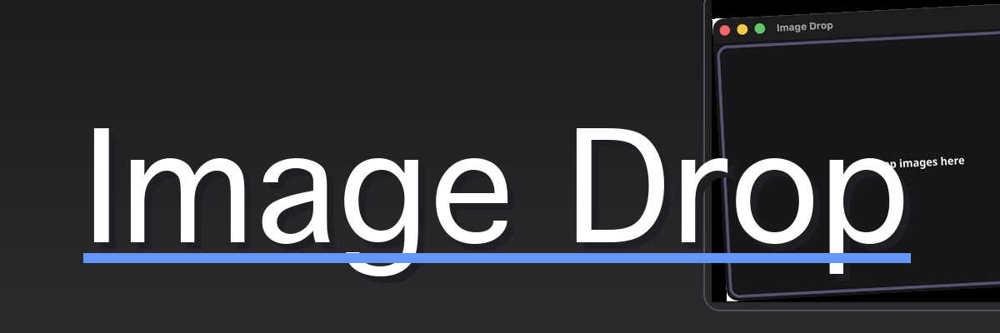
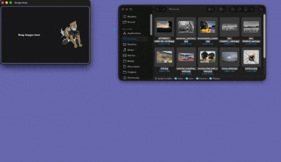
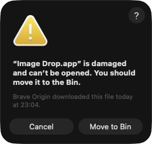

# Image Drop

[](https://github.com/frathe/imagedrop/actions/workflows/ci.yml)
[](https://github.com/frathe/imagedrop/releases/latest)
[](go.mod)
[](https://github.com/frathe/imagedrop/commits/main)
[](https://github.com/frathe/imagedrop/releases)
[](LICENSE)
[](https://buymeacoffee.com/gcobnk0grj)



A small [Fyne](https://fyne.io/) desktop app for quickly viewing images.
Drop one or more images onto the window to view them, and step through the
set with the keyboard.

## usage demo



## Features

- Drag-and-drop viewing of JPEG, PNG, GIF, WebP, BMP, TIFF, ICO, XPM, HEIC,
  and AVIF (`.jpg`, `.jpeg`, `.jpe`, `.jfif`, `.png`, `.gif`, `.webp`, `.bmp`,
  `.tif`, `.tiff`, `.ico`, `.xpm`, `.heic`, `.heif`, `.avif`, or anything
  reporting a matching `image/*` MIME type). HEIC/AVIF decode through
  embedded WASM (no cgo), so they need no system libraries and don't
  complicate cross-compilation
- Animated GIFs play back frame-by-frame at their encoded speed, correctly
  compositing each frame per its disposal method (a partial-region update
  won't leave stale pixels or wrongly clear the whole frame); playback stops
  automatically as soon as you navigate away
- EXIF orientation correction for JPEGs (auto-rotate/flip per the file's
  orientation tag)
- EXIF data window (`E`, or a link in the info overlay) showing camera
  make/model, lens, exposure, aperture, ISO, focal length, and capture
  date, for files that carry them — GPS/location is deliberately never
  read or shown
- Drop multiple files at once and step through them with the arrow keys
  (wraps around at both ends), or jump to the first/last with `Home`/`End`
- `G` opens a full-window thumbnail grid for jumping around a large drop by
  sight instead of arrowing through it; click a thumbnail, or use the arrow
  keys to move a highlight and `Return` to open it. Thumbnails are generated
  lazily and with bounded concurrency, in a separate small LRU cache from
  the full-size decode cache, so opening it on a several-thousand-file
  folder doesn't spawn a decode per file
- Zoom via `+`/`-`/`1`/`0`, or scroll (mouse wheel/trackpad) to zoom
  anchored at the cursor; click-drag or Shift+scroll to pan once zoomed in.
  No native pinch gesture — Fyne's desktop driver (GLFW) has no magnify/
  gesture callback, only scroll wheel, so Shift+scroll is the stand-in
- A plain drop replaces the current set; press `M` to toggle merge mode,
  which makes drops add to the set instead (no dedup — dropping the same
  file twice adds it twice). The title bar shows a `[merge]` prefix while
  it's on. It's a standing toggle rather than a drag modifier because
  drag-and-drop from the file manager never focuses the window, so OS-level
  modifier keys (Shift, etc.) held during the drag aren't observable
- Files are naturally sorted by name by default (`IMG_2.jpg` before
  `IMG_10.jpg`), not just the raw order the OS handed them over in; press
  `S` to cycle through capture date, modification time, file size, and the
  raw scan/drop order, and back to name. The title bar shows which one is
  active (`[sort: date]`, `[unsorted]`, etc.) except for the default
- Drop a mix of files and folders — folders are scanned recursively for
  supported images, with a spinner and a live counter shown while scanning
  large trees
- A file that fails to decode only once you navigate to it is dropped from
  the set and the next one is loaded automatically (wrapping around if it
  was the last), instead of leaving the title/position stuck on a file
  that isn't actually shown
- `Escape` closes the window
- Built-in end-user manual ([manual.md](internal/ui/help/manual.md), embedded at build time and
  rendered in its own scrollable window) via `F1` or **Help → Manual**;
  `Escape` closes just the manual window. Fyne's markdown renderer has no
  table extension, so keep `manual.md` table-free
- Window auto-resizes to fit the image, capped at 1500x950
- Image decoding happens off the UI thread so large files don't freeze the
  window; an indeterminate progress bar shows along the top edge while a
  decode is in flight
- Localized UI strings via `translations/*.json` (`fyne.io/fyne/v2/lang`),
  currently shipping English and German
- Merge mode, sort order, the picture-frame slideshow interval, and the
  (empty-dropzone) window size are remembered across launches, via Fyne's
  `Preferences` API

## Download

Pre-built binaries for Linux, Windows, and macOS are published on the
[Releases page](https://github.com/frathe/imagedrop/releases) — no Go
toolchain required. macOS builds are published for both Apple Silicon
(`image_drop-macos-arm64.zip`) and Intel (`image_drop-macos-x86_64.zip`); grab
the one matching your Mac. See [Building](#building) below to build from
source instead.

### macOS: "app is damaged" warning



The release build isn't signed with an Apple Developer ID or notarized, so
Gatekeeper quarantines it after download and shows this message. The app
isn't actually corrupted — to open it anyway:

- Right-click (Control-click) `Image Drop.app` → **Open** → confirm in the
  dialog that appears, or
- Run `xattr -cr "/path/to/Image Drop.app"` in Terminal to clear the
  quarantine flag, then open it normally.

## Requirements

- Go 1.26.5 or newer (see the `go` directive in [go.mod](go.mod))
- A C toolchain for cgo (Fyne's OpenGL bindings require it) — Xcode Command
  Line Tools on macOS, `gcc` + `libgl1-mesa-dev`/`xorg-dev` on Linux
- [Docker](https://www.docker.com/) — only needed to cross-compile the
  Windows or Linux builds via `fyne-cross`
- [`govulncheck`](https://go.dev/security/vuln) and the
  [GitHub CLI](https://cli.github.com/) (`gh`) — only needed for the
  `make security*` targets. `govulncheck` is installed by
  `make install-tools`; `gh` must be installed separately (e.g. `brew install
  gh`) and authenticated via `gh auth login`

## Running

```sh
make run
# or
go run .
```

## Building

All build tasks are defined in the [Makefile](Makefile). Run `make help` to
list them.

| Command                | Description                                                                                    |
|------------------------|------------------------------------------------------------------------------------------------|
| `make build`           | Native binary for the current OS/arch, output to `bin/image_drop`                              |
| `make package-mac`     | macOS `.app` bundle, output to `bin/Image Drop.app` (no Docker required)                       |
| `make package-windows` | Windows `.exe`, cross-compiled via `fyne-cross`/Docker, to `bin/image_drop.exe`                |
| `make package-linux`   | Linux binaries, cross-compiled via `fyne-cross`/Docker, to `bin/image_drop-linux-<arch>`       |
| `make build-all`       | Runs `package-mac`, `package-windows`, and `package-linux`                                     |
| `make install-tools`   | Installs the `fyne`, `fyne-cross`, and `govulncheck` CLIs used by the package/security targets |

Packaging is done with the [`fyne`](https://pkg.go.dev/fyne.io/fyne/v2/cmd/fyne)
CLI (native OS builds) and [`fyne-cross`](https://github.com/fyne-io/fyne-cross)
(Windows and Linux, via Docker containers with the appropriate cross toolchain
— cgo can't be cross-compiled from macOS without it). Windows defaults to
`amd64` (`WIN_ARCH` in the [Makefile](Makefile)). `package-linux` builds one
binary per architecture listed in `LINUX_ARCHES` (default: `amd64 arm64`),
named `bin/image_drop-linux-<arch>` so they don't collide; override on the
command line for a single arch, e.g. `make package-linux LINUX_ARCHES=arm64`.
`fyne-cross linux` also supports `386` and `arm`.

> **Note:** running an `amd64` Linux binary under an x86 emulator (e.g.
> Box64) on ARM hardware is unreliable for OpenGL apps like this one — build
> the matching `arm64` binary for ARM boards instead of emulating.

There are also `-debug` variants (`package-windows-debug`,
`package-linux-debug`) that build an unstripped binary with debug symbols
kept in, useful for diagnosing startup failures that only show up in a
packaged build.

> **Note:** `fyne package` bumps the `Build` field in
> [FyneApp.toml](FyneApp.toml) on every run. That's expected Fyne behavior,
> not a bug — decide for yourself whether to commit those bumps.

### Other development commands

| Command                     | Description                                                         |
|-----------------------------|---------------------------------------------------------------------|
| `make fmt`                  | `gofmt` all Go source files                                         |
| `make vet`                  | `go vet ./...`                                                      |
| `make test`                 | `go test ./...`                                                     |
| `make tidy`                 | `go mod tidy` — tidy go.mod / go.sum                                |
| `make security`             | Run all security checks (govulncheck + GitHub Dependabot alerts)    |
| `make security-govulncheck` | Scan dependencies for known Go vulnerabilities with `govulncheck`   |
| `make security-github`      | List open GitHub Dependabot alerts via `gh` (needs `gh auth login`) |
| `make clean`                | Remove `bin/`, `fyne-cross/`, and any stray packaged app/zip        |

> **Note:** `make security-github` requires the [GitHub CLI](https://cli.github.com/)
> (`gh`) to be installed and authenticated (`gh auth login`), and it must be run
> from a checkout with a GitHub `origin` remote.

## Testing

`make test` (or `go test ./...`) runs everything: unit tests colocated with
the code they cover (`internal/ui/*_test.go`, `internal/imaging/*_test.go`,
and so on) plus the end-to-end suite below. Shared test fixtures — synthetic
images in every supported format, temp files, and stubs for the OS-level
seams — live in `internal/uitest`.

### End-to-end suite (`internal/ui/e2e_test.go`)

Rather than a hand-copied replica of the UI that could drift out of sync,
the e2e tests drive the *real* app: `buildViewer(application fyne.App)` in
[internal/ui/build.go](internal/ui/build.go) is the exact widget/handler
wiring `main()` runs live, factored out so tests can call it too. Every
test in the package builds a fresh window through it (`newTestUI`), drives
it the way a user would — `handleDrop` for a drop, `handleKeyEvent` for a
key press — and checks two things:

- **State** — `v.files`, `v.index`, and widget visibility (`.Visible()`).
  Fast, exact, and portable; this is the real regression guard.
- **A screenshot** — the full window, captured via `win.Canvas()` and
  compared against a golden master PNG in `internal/ui/testdata/` using Fyne's own
  `test.AssertRendersToImage`. This catches appearance/z-order bugs state
  alone can't see — it's what caught the "stale image left behind an error
  toast" regression during development.

Run just this suite with:

```sh
go test -run TestE2E -v ./...
```

**Updating a golden master:** if a legitimate visual change makes one
stale, the failing test writes the new render to
`internal/ui/testdata/failed/<name>.png` (gitignored — never committed) and
reports that path. Inspect it, and if it looks right, copy it over
`internal/ui/testdata/<name>.png` to accept it as the new baseline.

**Known gap:** F1/the manual window isn't covered. Fyne's test theme only
defines fonts for 6 specific `TextStyle` combinations, and the manual's
markdown produces at least one combination outside that set, so measuring
it panics on a nil font resource — a limitation in Fyne's test theme, not
in this app.

**A note on background goroutines:** `go test` runs a package as one
process, and Fyne's test driver runs `fyne.Do` callbacks inline on the
calling goroutine rather than marshaling them to a UI thread — so a
goroutine that outlives the test that started it will do UI work in the
middle of a later, unrelated one. Every background operation therefore has
a completion signal, and the suite has a helper to wait on it: `settleToast`
after anything that raises a toast, `settleThumbs`/`settleSlideshow`/
`settleChooser` for the grid, picture-frame mode, and the file dialog, and
`dropAndWait` (which covers the scan, the load, and its neighbor preloads)
for a drop. Add the matching wait if you add a scenario that starts one.

## Project layout

```sh
main.go               Entry point: app setup, translations, CLI arguments
internal/ui/          The application - the viewer core and the key dispatcher
  run.go              Run(): builds the window, wires startup/shutdown
  build.go            buildViewer(): the whole widget tree, in one place
  zoom/ grid/         One package per feature that owns its own state,
  slideshow/ help/    each declaring only what it needs from the app
  deletion/ exifwin/
  widgets/            Shared viewer-free UI mechanics
  assets/             Placeholder/welcome art, embedded at build time
  help/manual.md      End-user manual, embedded at build time
  testdata/           Golden master screenshots for the e2e suite
internal/imaging/     Read - decode - EXIF-orient - cache pipeline
internal/uitest/      Shared test fixtures and OS-seam stubs
translations/         JSON translation bundles, embedded at build time
assets/               Icon and README artwork (packaging, not embedded)
FyneApp.toml          Fyne app metadata (name, ID, version, build number)
Makefile              Build, package, and dev-workflow tasks
ARCHITECTURE.md       Package map - start here to find anything
```

## Contributing

Bug reports, feature requests, and pull requests are welcome — see
[CONTRIBUTING.md](.github/CONTRIBUTING.md) for how to get set up and what CI
checks for. This project follows a
[Code of Conduct](.github/CODE_OF_CONDUCT.md). Found a security issue? See
[SECURITY.md](.github/SECURITY.md) instead of opening a public issue.

## License

MIT — see [LICENSE](LICENSE). Third-party dependencies are listed with their
own licenses in [THIRD-PARTY-NOTICES.md](THIRD-PARTY-NOTICES.md).

## Development

Built with the assistance of Coffee and [Claude Code](https://claude.com/claude-code).
